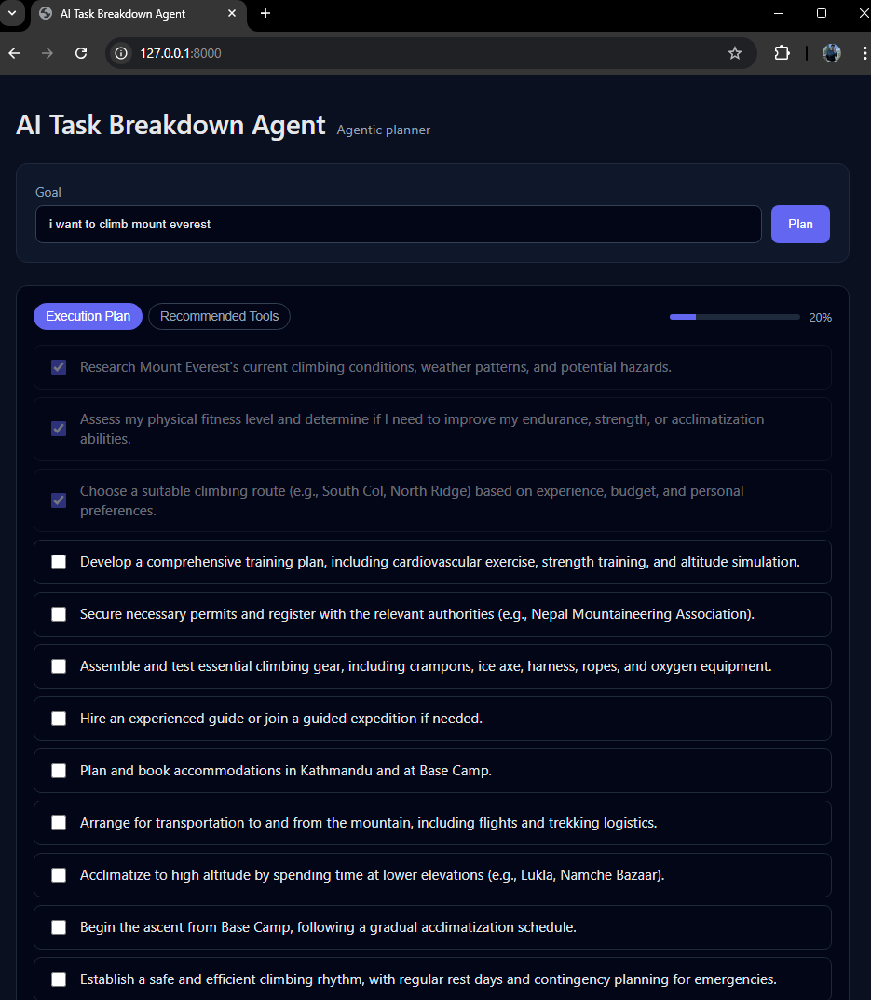

# AI Task Breakdown Agent

A clean, interactive agentic AI tool that converts vague, high-level goals into structured execution plans with progress tracking.

This project demonstrates how multiple AI agents can collaborate to produce actionable plans, while the frontend visualizes progress through a checklist-based workflow.

---

## 🚀 Features

- 🧠 **Agentic AI planning** using multiple autonomous agents
- ✅ **Interactive checklist** with auto-dependency logic  
  (checking a step auto-checks all previous steps)
- 📊 **Universal progress bar** that updates in real time
- 🧭 **Tabbed interface** (Execution Plan ↔ Recommended Tools)
- 💾 Frontend state preserved while switching tabs
- 🎨 Clean, professional UI suitable for demos & resumes
- 🔒 Uses **local LLMs** (Ollama) — no OpenAI key required

---

## 🛠 Tech Stack

**Backend**
- Python
- FastAPI
- CrewAI
- Ollama (local LLM)

**Frontend**
- HTML
- CSS (Flexbox)
- Vanilla JavaScript

---

## 📂 Project Structure

```text
AI-Task-Breakdown-Agent/
├── main.py
├── agents.py
├── tasks.py
├── static/
│   ├── index.html
│   ├── style.css
│   └── script.js
├── venv/
├── README.md
└── .gitignore
```

## 🖥️ Website UI Preview


